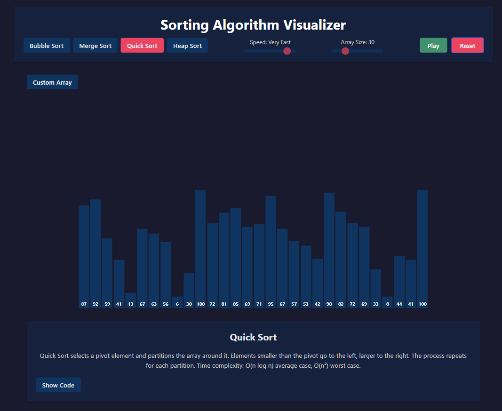
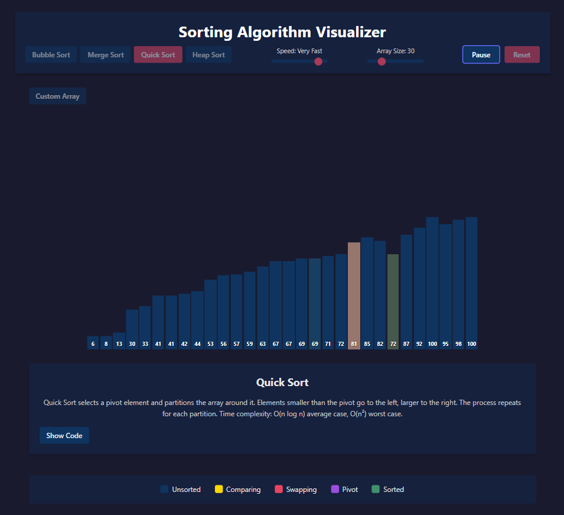
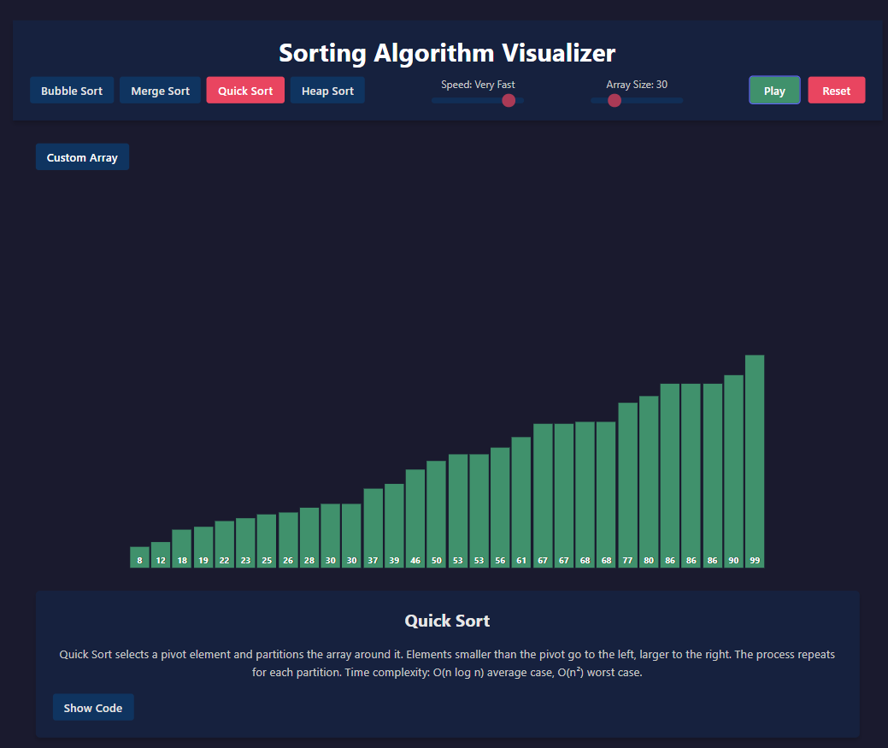

<div style="text-align:center;">
	
	
	
</div>

# Sorting Algorithm Visualizer

A compact React + Vite project that visualizes common sorting algorithms (bubble sort, quicksort, merge sort, etc.) with interactive controls for speed, array size, and algorithm selection.

This README explains the project structure, how to run the app locally, how to add or modify algorithms, and deployment notes.

**Live preview:** Start the dev server and open http://localhost:5173 (or the port shown by Vite).

**Tech stack:** React, Vite, plain CSS

## Features

- Visual, step-by-step animations for sorting algorithms
- Select algorithm, array size, and animation speed
- Code view of the currently selected algorithm (`src/components/AlgorithmCode.jsx`)
- Clean, minimal UI with responsiveness

## Repository structure

- `index.html` — app entry
- `package.json` — scripts & dependencies
- `src/` — React source files
  - `main.jsx` — app bootstrap
  - `App.jsx` / `App.css` — top-level app
  - `components/SortingVisualizer.jsx` — main visualizer component
  - `components/AlgorithmCode.jsx` — shows algorithm code
  - `components/Header.jsx` — header / controls
  - `utils/sortingAlgorithms.js` — algorithm implementations
- `images/` — screenshots used in this README

## How to run (development)

Prerequisites:

- Node.js (v14+ recommended)
- npm (comes with Node.js) or yarn

Commands:

```bash
# install dependencies
npm install

# start dev server (Vite)
npm run dev
```

Common `package.json` scripts in this project:

- `dev` or `start` — run Vite dev server
- `build` — create a production build
- `preview` — locally preview the production build

If `npm run dev` fails due to port conflicts, try another port:

```bash
npm run dev -- --port 5174
```

## How to build and deploy

```bash
# build for production
npm run build

# preview the production build locally
npm run preview
```

Deploy the contents of the `dist/` folder to any static-hosting service (Netlify, Vercel, GitHub Pages, Surge, etc.).

## Adding or editing sorting algorithms

Algorithms live in `src/utils/sortingAlgorithms.js`.

- Each exported function should accept an array and return a list of animation steps (or use the project's existing step format). See existing implementations for the expected structure.
- To add an algorithm:
  1.  Implement the algorithm in `sortingAlgorithms.js` following the same API used by other algorithms.
  2.  Add the new algorithm name to the algorithm selector in `components/SortingVisualizer.jsx`.
  3.  Optionally add a code snippet to `components/AlgorithmCode.jsx` so users can view the implementation.

## Customization

- Change animation speeds and timing by updating the speed constants in `SortingVisualizer.jsx`.
- Modify styling in `src/App.css` and `src/index.css`.

## Troubleshooting

- If you see ESLint or build errors, run `npm install` to ensure dependencies are installed.
- Check the terminal for errors when running `npm run dev` — Vite prints helpful diagnostics.

## Tests

This starter repo does not include automated tests. To add tests, consider Jest or React Testing Library and add relevant scripts to `package.json`.

## Contributing

Contributions are welcome. Open an issue first if you're planning a larger change. Keep changes focused and include a description and screenshots where appropriate.

## License

Specify a license in your repository (e.g., add a `LICENSE` file). If you want, I can add an MIT license file for you.

---

If you'd like the images arranged differently (side-by-side, smaller thumbnails, or a gallery with captions), tell me how you'd like them and I will update the README.
